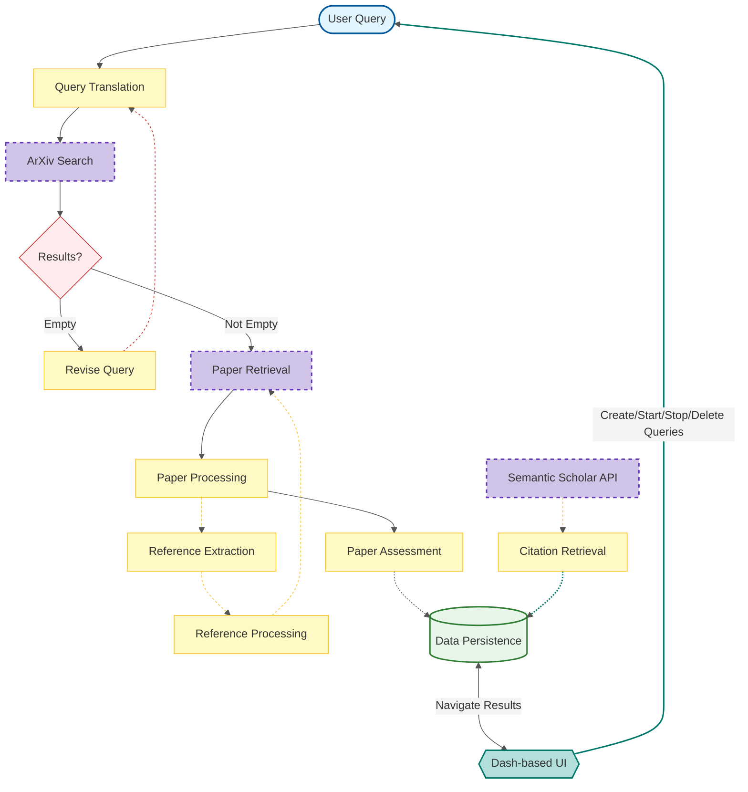

# ArXplorer Development Guide

This document provides detailed information for developers interested in contributing to or understanding the ArXplorer project.

## System Architecture

The following diagram illustrates the main components and data flow of the ArXplorer system:



## How It Works

### 1. User Query Processing

1. The user inputs a natural language query through the Dash-based UI.
2. The query is passed to the `ArxivApiQueryGenerator`, which translates it into an ArXiv-compatible search string using advanced NLP techniques.
3. If the generated query returns no results, the system suggests a revision, leveraging `dspy.Suggest` for query refinement.

### 2. ArXiv Search and Paper Retrieval

1. The translated query is used to search ArXiv via their API.
2. For each paper found, the system initiates a parallel retrieval process.
3. Papers are fetched using either HTML or PDF conversion methods, depending on availability and configuration.

### 3. Paper Processing and Analysis

1. Retrieved papers undergo parallel processing:
    - **Content Extraction**: Full text is extracted and converted to a standardized format.
    - **Relevance Assessment**: The `ArxivAssessor` uses AI to evaluate the paper's relevance to the original query, assigning a score and providing detailed explanations.
    - **Reference Extraction**: The `ArxivReferenceExtractor` identifies and extracts references from the paper.

2. Each extracted reference is fed back into the retrieval process, creating a recursive exploration of the topic.

### 4. Citation Retrieval

1. In parallel to other processes, the `CitationsRetriever` fetches citation counts for papers using the Semantic Scholar API.
2. Citation data is periodically updated to keep information current.

### 5. Data Management

1. Processed papers, their assessments, extracted references, and citation data are stored in a database managed by `DbManager`.
2. The system supports continuous updates, allowing for refinement of results over time.

### 6. Multi-threaded Execution

1. The `PriorityLimitedThreadExecutor` manages concurrent execution of tasks.
2. Tasks are prioritized to ensure efficient use of resources and timely processing of the most relevant papers.

### 7. User Interface and Result Navigation

1. The Dash-based UI allows users to:
    - Create, start, stop, and delete queries
    - View and navigate through processed results
    - Filter and sort papers based on relevance, citation count, and other metrics
    - Access detailed assessments and explanations for each paper

### 8. Continuous Processing

1. The system continues to process papers and update results until the user stops the query or a predefined limit is reached.
2. New papers and updated citation counts are continuously integrated into the results, providing an evolving view of the research landscape.

### 9. Extensibility and API Integration

1. The system is designed to easily integrate with additional external APIs and data sources.
2. The modular architecture allows for the addition of new analysis tools or processing steps without significant restructuring.

## Development Setup

1. Clone the repository:
   ```bash
   git clone https://github.com/marfago/arxplorer.git
   cd arxplorer
   ```

2. Install dependencies using Poetry:
   ```bash
   poetry install
   ```

3. Set up the Google Gemini API key:
   ```bash
   export GOOGLE_API_KEY=your_gemini_api_key_here
   ```

## Running Tests

To run the test suite:

```bash
poetry run pytest
```

To run tests with coverage:

```bash
poetry run pytest --cov=arxplorer --cov-report=term-missing --cov-report=html
```

## Code Style and Linting

We use Black for code formatting and Flake8 for linting.

To check code style:

```bash
poetry run black --check .
```

To run the linter:

```bash
poetry run flake8 .
```

## Contributing Guidelines

1. Fork the repository and create your branch from `main`.
2. If you've added code that should be tested, add tests.
3. Ensure the test suite passes.
4. Make sure your code lints.
5. Issue that pull request!

Please refer to the [CONTRIBUTING.md](CONTRIBUTING.md) file for more detailed information on our contribution process.

## License

This project is licensed under the Apache License 2.0. See the [LICENSE](LICENSE) file for details.